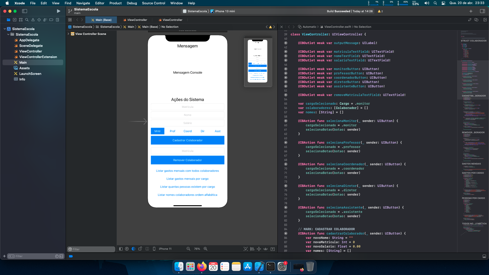

# DesafioEscola
Projeto para implementar o sistema de uma escola em um aplicativo. Exercício feito no curso Swift Explorations do Instituto de Pesquisas Eldorado.

## Screenshot do projeto

## Informações

1. O arquivo EscolaEmApuros.playground contém os exercícios e a implementação de uma classe Escola.
2. Dentro da pasta SistemaEscola contém todo o projeto com a interface e as funcionalidades do aplicativo da Escola.
